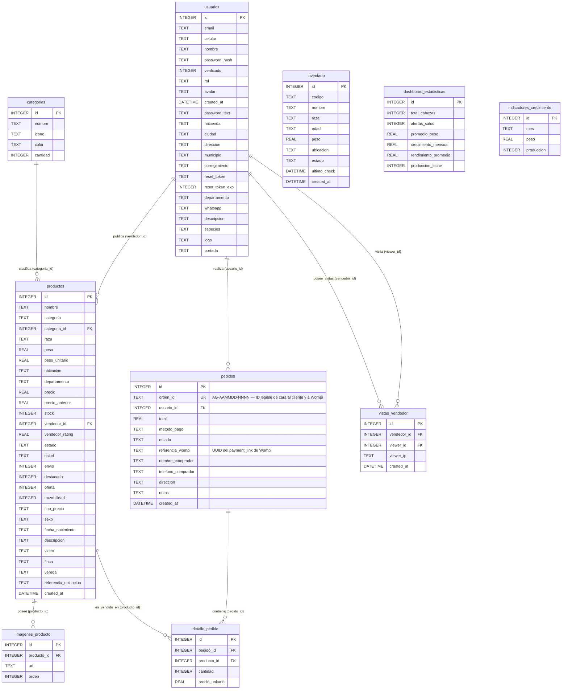

# Diagrama Entidad-Relación (ER) - Esquema Actual

**Base de datos de referencia:** PostgreSQL 16 (`agroup` — Docker local / Neon en staging)  
**Última actualización:** 2026-07-27 — Refleja el esquema final post-Bloque D (migración 100% completada). Se removieron las columnas legacy (`productos.vendedor`, `productos.imagenes`, `pedidos.productos`) y se formalizaron las tablas `imagenes_producto` y `detalle_pedido` como relaciones FK relacionales directas.

## Leyenda y Notas del Diagrama ER

- **Líneas Continuas (`||--o{`):** Relaciones relacionales con FK formalmente declaradas e implementadas con constraints en PostgreSQL (`imagenes_producto.producto_id ON DELETE CASCADE`, `detalle_pedido.pedido_id ON DELETE CASCADE`, `detalle_pedido.producto_id ON DELETE RESTRICT`).
- **Normalización de Tablas 1:N (Bloques A, B, C, D):** Las columnas legacy con JSON empaquetado (`productos.imagenes` y `pedidos.productos`) y la redundancia `productos.vendedor` fueron eliminadas de forma segura de la base de datos tras verificar la desvinculación completa en el código.
- **`ON DELETE` en `productos.vendedor_id`:** Se mantiene `RESTRICT` + borrado lógico (`estado = 'inactivo'`) para preservar integridad referencial con los registros históricos en `detalle_pedido`.
- **`pedidos.orden_id` — Bug preexistente resuelto en migración:** Identificador legible de pedido (`AG-AAMMDD-NNNN`) usado como referencia en transacciones de Wompi. Ver [Hallazgo #5 en migracion-postgresql.md](file:///c:/Users/riosv/Desktop/AgroUp%20Desarrollo/AgroUp/docs/migracion-postgresql.md).

